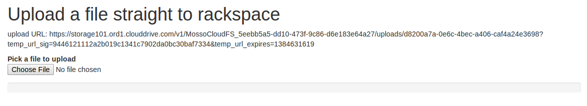
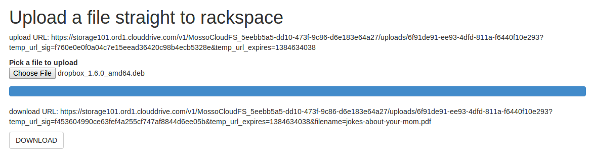

+++++++++++++++++++++++++++++++++++++++++++++++++++
Upload files directly to Rackspace from the browser
+++++++++++++++++++++++++++++++++++++++++++++++++++

Background
==========

We need to let users take files (possibly really big files) from their
hard drive and push them straight to the `Rackspace Cloud Files storage
service <http://www.rackspace.com/cloud/files/>`.

We don't want the upload traffic anywhere near our servers.

Run the example
===============

The apr.py script depends on the the excellent `Pyrax
<https://github.com/rackspace/pyrax>` package, so install that first,
and then do this stuff::

$ git clone git@github.com:216software/ajax-put-rackspace.git
$ cd ajax-put-rackspace
$ python apr.py YOUR_RACKSPACE_USER_NAME YOUR_API_KEY

Then in your browser, open up http://localhost:8765 and you should see
something like the screenshot in before-upload.png

Now upload a file.  And hopefully, you'll watch a pretty blue scrollbar
track the upload's progress, and when it's done, you see something like
what's in this screenshot:

Click the DOWNLOAD button.  You will get the file you uploaded, but
named with a different name.

How we did it
=============

1.  Make a container in rackspace cloudfiles.

2.  Set metadata on that container to allow CORS from the domain hosting
    our HTML file.

3.  Make a temp URL that we can upload to.

4.  Write HTML to build a simple input type=file widget.

5.  Write javascript so that when a user picks a file with the file
    input tag, we use a `FileReader
    <https://developer.mozilla.org/en-US/docs/Web/API/FileReader>` to
    read the contents of the file into a buffer.

6.  Use more javascript to do an ajax PUT to the temp URL created
    in step 3.

The python part
===============

The Pyrax package made this easy.

Here's how to create a container in the rackspace cloudfiles service::

    $ pip install pyrax # this takes a while!
    $ python
    >>> import pyrax
    >>> pyrax.set_setting('identity_type',  'rackspace')
    >>> pyrax.set_credentials(YOUR_USER_NAME, YOUR_API_KEY)

    >>> uploads_container = pyrax.cloudfiles.create_container('uploads')

Don't worry!  Nothing stupid will happen if your "uploads" container
already exists.  You'll get a reference to the existing container.

Next set some metadata so that the browser will allow cross-domain
AJAX::

    >>> uploads_container.set_metadata({
        'Access-Control-Allow-Origin': 'http://localhost:8765'})

Replace localhost:8765 with your domain and replace http with https if
that's how you serve your site.

Next make a URL that you can give to the user's browser and say "send
your data to this".

    >>> import uuid
    >>> filename = str(uuid.uuid4())
    >>> upload_url = pyrax.cloudfiles.get_temp_url(
        uploads_container, filename, 60*60, method='PUT')

I'm using uuid.uuid4 to make a unique name, so that I never risk
uploading on top of existing data.

The other two arguments to get_temp_url are the number of seconds that
the URL lives for (60*60 means one hour) and the method='PUT' means this
is a URL that the browser will push to, not pull from.

In other words, after an hour, requests won't succeed, and only PUT
requests are allowed.

Like I said, the python part is really pretty easy!

Security considerations
=======================

The rackspace cloudfiles servers don't check if the request comes from
from a user that authenticated with your web application.

So, if a third party eavesdrops on the temporary URL we make, then it
can use curl or whatever tool they want to push a different file.

When you make a temporary URL, you need to make sure that the right
person and only the right person gets it.

How to set the filename for downloads
=====================================

Don't worry about how I'm using ugly-looking uuid filenames in the
upload URL.

You can build temporary URLs with any name you want.

You just need to add a query-string parameter "filename" to the link,
like this::

    <a href="{download_url}&filename=jokes-about-your-mom.pdf">download</a>

The relevant rackspace documentation is `here <http://docs.rackspace.com/files/api/v1/cf-devguide/content/TempURL_File_Name_Overrides-d1e213.html>`.

I suspect there's a bunch of neat stuff like this, like manually setting
mime types, or whatever.

The javascript part
===================

The javascript part is not so fun.  We have to juggle callbacks for a
bunch of asynchronous calls.

**I would love it if somebody forked this repository and sent me a pull
request with a more elegant way to handle this stuff.**

Here's what the code does:

*   Sets an event listener on the on <input type="file"> tag::

    $("#upfile").on('change', function (e) {...

*   That event listener makes a FileReader instance named fr::

    var fr = new FileReader();

*   Then it sets a callback on the fr instance to handle when
    the fr instance finishes loading a file::

    fr.onload = (function (file_object, input_file_node) {...

*   Then it tells the fr instance to load in the file chosen by the user
    in the <input type="file"> tag::

    fr.readAsArrayBuffer(this.files[0]);

*   When the fr instance finishes reading all the data from inside the
    file, the onload callback fires.

*   Inside the onload callback, we use the good ol' jQuery $.ajax method
    to send the data from the file to rackspace.  It took us a while to
    figure out that to get the data, we needed to use the .result
    attribute::

    $.ajax({
        ...
        data: fr.result,
        ...
    });

*   The success callback for $.ajax request in this scenario doesn't do
    anything interesting.  It just un-hides the link to the download
    URL::

        success: function (data) {
            console.debug('Upload complete -- do what you want here');
            $("div#download_url").collapse('show');
        },

    But in my "real code", I do another AJAX request back to my server
    to tell the database to record that a file was successfully uploaded
    to the upload URL.  And I store the original file name and the mime
    type into the database.

*   It isn't strictly necessary, but I want to show a progress bar in
    the browser as the file uploads.  So I made my own xhr object for
    the $.ajax code to use, and that xhr object notice the "progress"
    event::

        xhr: function() {

            var xhr = new window.XMLHttpRequest();

            // Upload progress
            xhr.upload.addEventListener("progress",

                function(evt) {{

                    if (evt.lengthComputable) {

                        var percentComplete = evt.loaded / evt.total;

                        console.debug('percentComplete: ' + percentComplete);

                        $("#progress-bar div.progress-bar").css('width',
                            String(100*percentComplete) + "%");

                    }
                },
                false);

            return xhr;
            },

Alternate solutions
===================

Handle the upload and then push to rackspace
--------------------------------------------

The rookie solution involves writing some web application code to accept
the file upload from the browser, save it to /tmp, and then upload it to
rackspace.

To be a little faster, perhaps just the first half happens during during
the web request, and some unrelated background process uploads the file
to rackspace later.

Risks with this approach
------------------------

We're using the fantastic `gunicorn <http://gunicorn.org>` WSGI server
with regular plain-jane vanilla sync workers.

Remember that with a synchronous worker, when a user makes a request,
that request completely ties up the back-end worker process until it
replies.  That's why you need a bunch of sync workers working
simultaneously.  A request that comes in will get handled by one of the
idle workers -- as long as somebody is idle.  Otherwise, requests queue
up.

When too many users try to upload too many really big files at the same
time, then all of the workers could be tied up, and the application
would become unresponsive.

We could always just keep a ton of web application processes around, so
that no matter how busy the application gets, we always have some idle
workers, but that's a worst-case solution.  That's like dealing with a
weight problem by buying a bigger pair of pants.

What about using async workers?
===============================

Well, first of all, I want to get the files up to rackspace, and this
way gets that done better.

Here's the typical use case for async workers: a request comes in and
and you need to talk to some remote API before you can reply, and that
API sometimes takes a second to respond.

After sending the message to the API, your worker is just sitting there
idly, waiting for a reply.

An async worker can go back to answer other requests while waiting for
that API to finish.

Under the hood, these async libraries all monkey-patch stuff like the
socket library, so that when you read or write from a socket, you
automatically yield.

Here's the problem that we ran into (which is likely totally fixable, or
even never was broken).

We're using the excellent werkzeug library to parse file uploads.  It
internally pulls data from the socket named "wsgi.input" passed in with
the WSGI environ.

Reading from that wsgi.input socket doesn't seem to yield out control,
so while our async worker was reading the gigantic file being uploaded,
even though the async worker was idle, it was not switching to go back
and answer other requests.

We couldn't figure out a nice way to force the werkzeug request object
to intermittently yield while reading from the wsgi.input socket.  We
can't always force it to do this -- lots of people use werkzeug without
also using gevent.

The werkzeug code doesn't know it is being run inside a gunicorn
async gevent worker.

.. vim: set syntax=rst:
